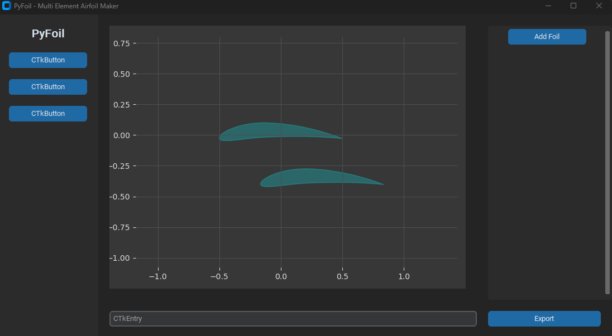
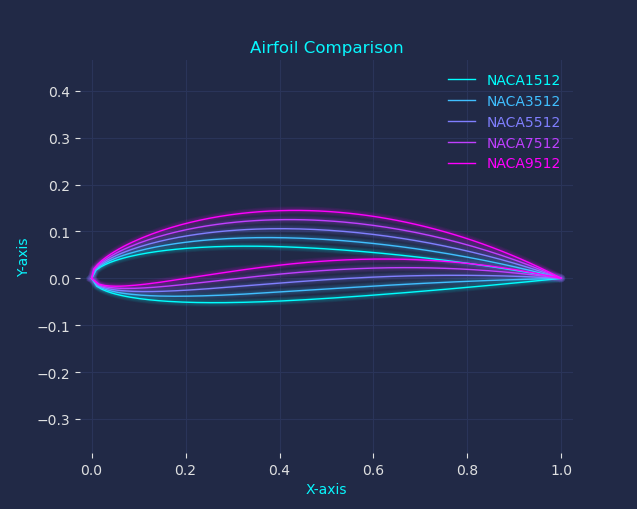

<div align="center">
 

 <h1 align="center">  PyFoil </h1>
 
  <a href="https://github.com/AndersGroengaard/pyfoil/issues/new?assignees=&labels=bug&template=01_BUG_REPORT.md&title=bug%3A+">Report a Bug</a>
  ·
  <a href="https://github.com/AndersGroengaard/pyfoil/issues/new?assignees=&labels=enhancement&template=02_FEATURE_REQUEST.md&title=feat%3A+">Request a Feature</a>
  .
  <a href="https://github.com/AndersGroengaard/pyfoil/discussions">Ask a Question</a>
</div>

<br/>


<div align="center">

[]()
[]()
[](https://www.gnu.org/licenses/gpl-3.0)


 
 
 <br/>
<i> Python package for creating experimental and multi-element airfoils </i>
 
</div>


 

<!-- TABLE OF CONTENTS -->
<h2 id="table-of-contents"> :book: Table of Contents</h2>

<details open="open">
  <summary>Table of Contents</summary>
  <ol>
    <li><a href="#about"> ➤ About </a></li>
    <li><a href="#features"> ➤ Features</a></li>
    <li><a href="#planned-features"> ➤ Planned Features</a></li>
    <li><a href="#limitations"> ➤ Limitations</a></li>
    <li><a href="#howtouse"> ➤ How to use</a></li>
    <li><a href="#authors"> ➤ Authors</a></li>
    <li><a href="#license"> ➤ License</a></li>
  </ol>
</details>

 <br/>
 
<!-- ABOUT THE PROJECT -->
<h2 id="about"> :clipboard: About</h2>
 
<p align="justify"> 
   The intended purpose of this package is to serve as a tool to find the best airfoil shape for your engineering application.
   Use PyFoil to create multi-element airfoils and analyse them in other awesome packages like:
     - <a href="https://github.com/peterdsharpe/AeroSandbox">AeroSandbox</a>
     - <a href="https://github.com/peterdsharpe/AeroSandbox">OpenFOAM</a>
 
 
   Hope you make some efficient wind (or water!) turbines for some renewable energy, and/or energy-efficient vehicles :airplane: so we can save the planet :earth_africa: 
   

   
</p>

<br/> 


<!-- Features -->
<h2 id="features"> :dart: FEATURES </h2>

Use the GUI to create complicated airfoil layouts at lightning speed, like adding slats, flaps, or cascading airfoils:




Amongst other things the GUI and the code supports:
* <b> Generating one or more NACA Airfoils: </b>
 Currently the NACA foil families that can be generated are:
  - NACA 4-Digit
  - NACA 4-Digit Modified
  - NACA 5-Digit 
  - NACA 16-Series
* Fetch historical airfoils
* Create multi-element airfoils.  
  

  
  
  
Foils are generated according to the definition from the  <a href="https://m-selig.ae.illinois.edu/ads/coord_database.html" > UIUC Airfoil Coordinates Database </a>, in which is stated:

> "The coordinates order starts from upper surface trailing edge, then wraps around the leading edge to the lower surface trailing edge"

<br/> 

<!-- Planned Features -->
<h2 id="planned-features"> :goal_net: PLANNED FEATURES </h2>


* Load a datasheet with a timeseries of wind speeds and angles of attacks, and find the best performing airfoil in terms of lift-to-drag ratio.

<br/> 

 

 

 

<br/> 

 
 
 
 
 
 
  
<h2 id="howtouse">  :man_technologist: HOW TO INSTALL  :woman_technologist: </h2>


 
 
 Install from PyPI:
 ```
    pip install pyfoil
  ```
or via conda:
 ```
    conda install -c conda-forge pyfoil
 ```
or from source on GitHub:
 ```
    git clone https://github.com/agroengard/pyfoil
    cd pyfoil
    pip install .
 ```
 
 
 
 
 
 
 
 
 
<h2 id="howtouse">  :man_technologist: HOW TO USE  :woman_technologist: </h2>


To create 4 and 5 digit NACA airfoil points by code, and also plot and save them, you could write (See also the example.py file):

```python

from naca import NACA

# NACA 4-Digit airfoil:
airfoil = NACA("2310")

# Retrieve the individual points:
pts = airfoil.pts 

# Plot the airfoil:
airfoil.plot()

# Save the points to a .txt file 
airfoil.save()  
```
Likewise for a 5-digit NACA airfoil:

```python
# NACA 5-Digit airfoil:
airfoil = NACA("23116")
airfoil.plot()
airfoil.save()
 
```

If you want to generate and plot multiple airfoils from a list you could go:

```python
from foils import NACAs 
 
my_foils = ['1512','3512', '5512', '7512', '9512']
foils = NACAs(my_foils)
foils.plot()

```



<br/>


 
<h2 id="cite"> :goal_net: How to cite </h2>

If you have used PyFoil in your research, and you want to cite it, you could for example use the following BibLatex entry:

```
@misc{agroengaard2023,
  author = {Grøngaard, Anders},
  title = {PyFoil - Airfoil editing with Python},
  year = {2023},
  publisher = {GitHub},
  journal = {GitHub repository},
  howpublished = {\url{https://github.com/agroengaard/pyfoil}},
  }
```


 
<h2 id="authors"> :goal_net: AUTHORS </h2>

Written by [@Agroengaard](https://github.com/Agroengaard)


<br/>

<h2 id="license"> :book: License</h2>

This project is licensed under a GNU GENERAL PUBLIC LICENSE - see the LICENSE.md file for details

<br/>
